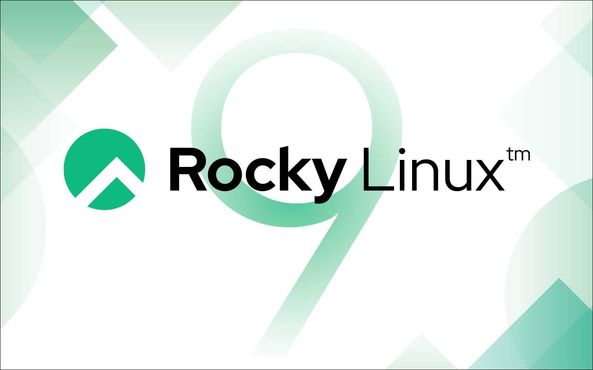

# Presentación

Este documento describira el uso y la gestión de paquetes RPM en distribuciones basadas en Red Hat, con un enfoque especial en Rocky Linux. Se abordará la estructura de los paquetes, los repositorios y un caso práctico para ejemplificar su uso.
